# Ansible使用手册

## 准备工作

### Ansible安装（控制节点）

```bash
# 环境：centos7.0

# 安装ansible
sudo yum update && sudo yum install epel-release
sudo yum install ansible
sudo yum install python3
pip install paramiko
sudo yum install sshpass

# 确认ansible安装成功
ansible --version
```


### VS Code准备

#### windows安装 + ssh插件下载

链接：https://code.visualstudio.com/sha/download?build=stable&os=win32-x64-user

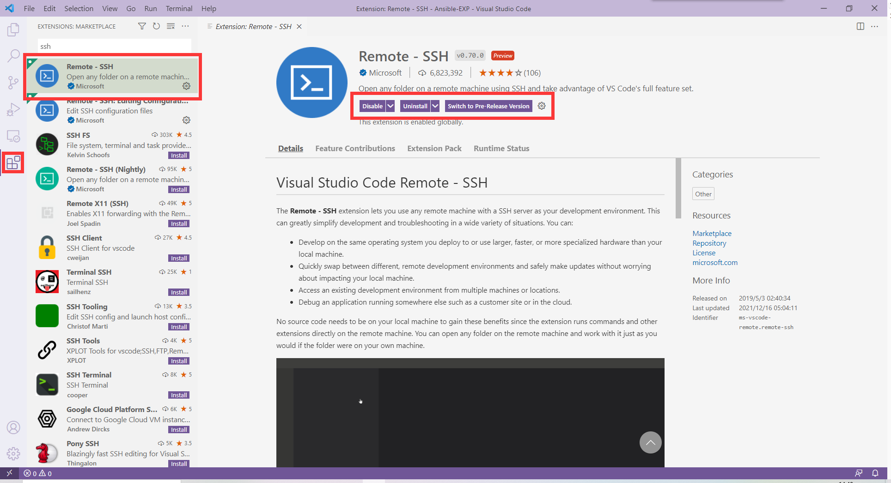

#### 连接远程主机

1. 重启vscode
2. 点击左下角图标，连接主机（控制节点）

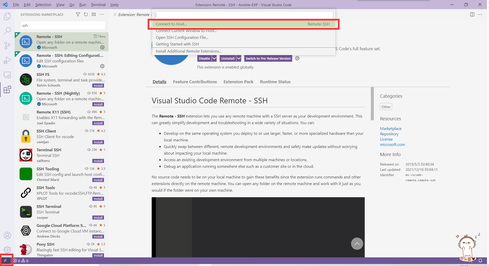

3. 输入`用户名@密码`

4. 然后输入密码，即可连接远程主机


## Ansible通信建立

1. 在远程主机（控制节点），创建工作目录
2. 创建host文件（inventory），添加被控制主机的相关信息

```yml
# 格式：被控制主机ip ansible_user="被控制主机名" ansible_password="被控制主机密码"
# 注意属性之间必须有空格，但等号两侧不要加空格
192.168.144.17 ansible_user="centos-demo-1" ansible_password="123456"
```

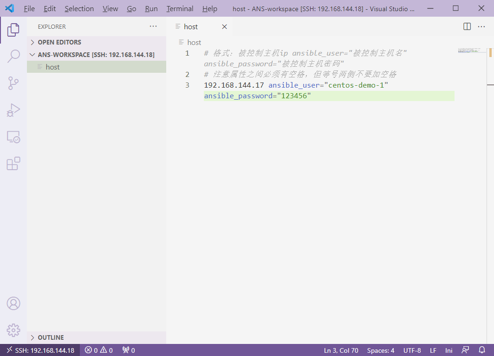

3. vscode上部点击`terminal`打开终端，依次执行

```bash
export ANSIBLE_HOST_KEY_CHECKING=False
ansible all -i host -m ping
```

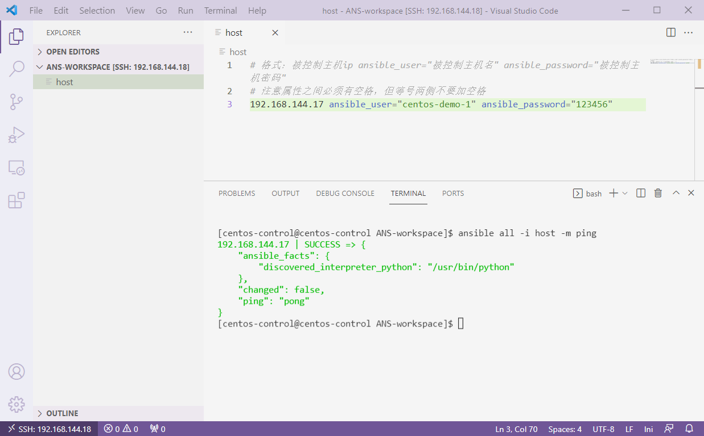

返回`success`，通信建立成功


## 在远程主机执行简单任务

### 查看远程主机网卡

```bash
ansible all -i host -a "/usr/sbin/ip a"
```

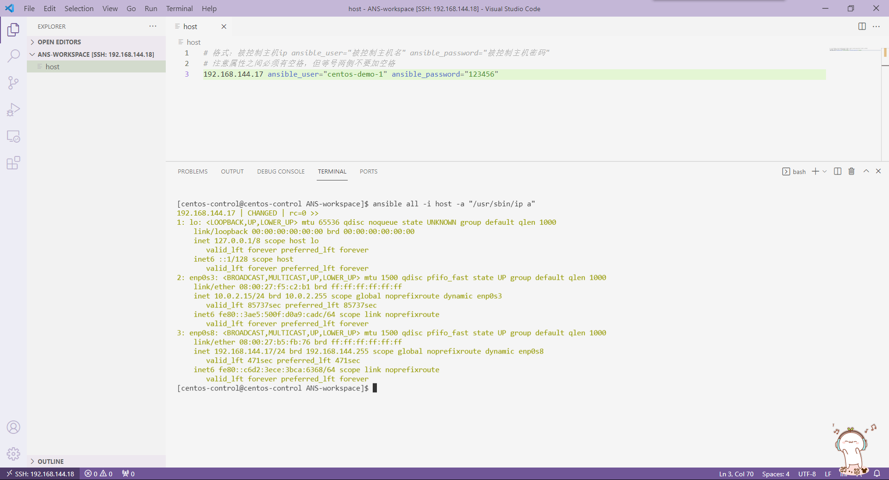


### 在远程主机创建文件

```bash
ansible all -i host -m file -a "state=touch dest=~/1.txt mode=777"
```

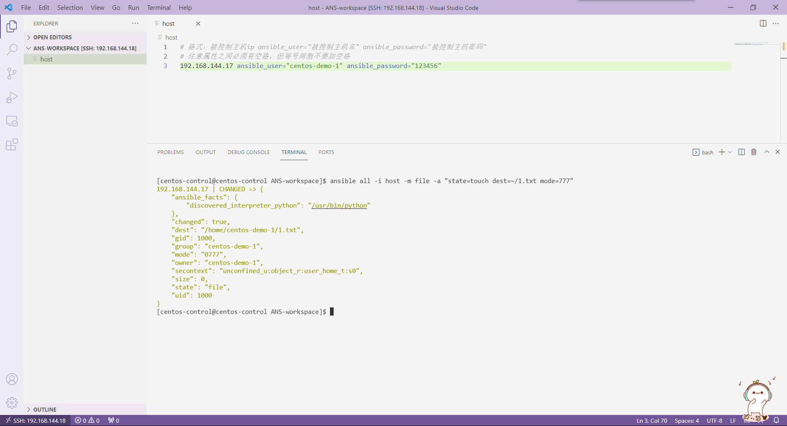


## 在远程主机执行多个任务

1. 在工作目录创建`playbook.yml`文件（注意格式）

```yml
---
- hosts: 192.168.144.17
  tasks:
    - name: test
      command: /usr/sbin/ip a
    - name: test2
      file:
        state: touch
        dest: ~/2.txt
        mode: 777
```

```bash
ansible-playbook -i host playbook.yml
```

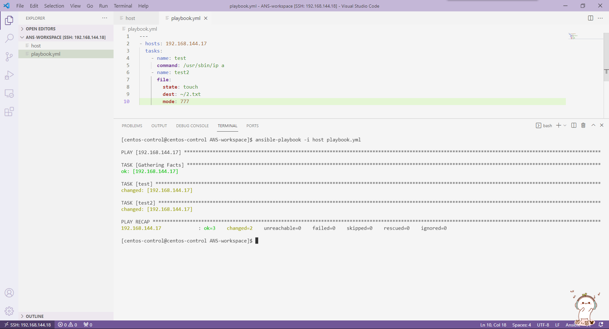

2. 返回成功，这个任务一下子执行了两条任务，不过`ip a`命令并没有返回信息，修改`playbook.yml`文件，添加一个调试任务返回信息

```yml
---
- hosts: 192.168.144.17
  tasks:
    - name: test
      command: /usr/sbin/ip a
      register: returned_value
    - name: debug
      debug:
        msg: "{{ returned_value }}"

    - name: test2
      file:
        state: touch
        dest: ~/2.txt
        mode: 777
```

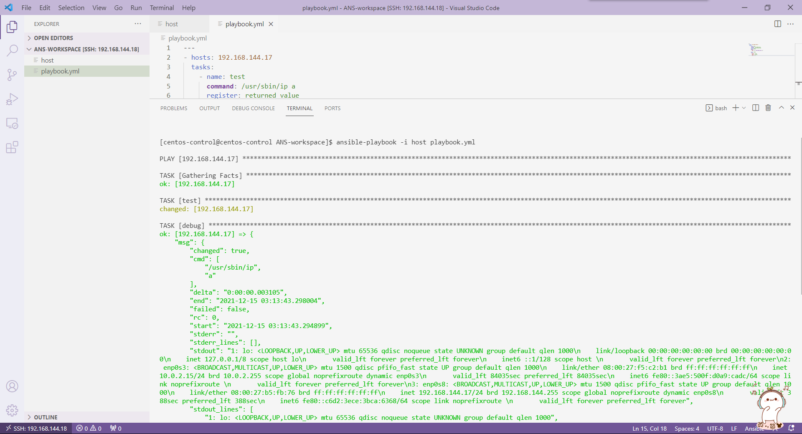


## 常见任务（模块）示例

### 把远程主机`/etc/passwd`文件备份到`/tmp/temp.txt`文件

**同命令：**`cp /etc/passwd /tmp/temp.txt`

```yml
---
- hosts: 192.168.144.17
  tasks:
    - name: copy the file
      copy:
        remote_src: yes
        src: /etc/passwd
        dest: /tmp/temp.txt
      register: returned_value
    - name: debug
      debug:
        msg: "{{ returned_value }}"

```

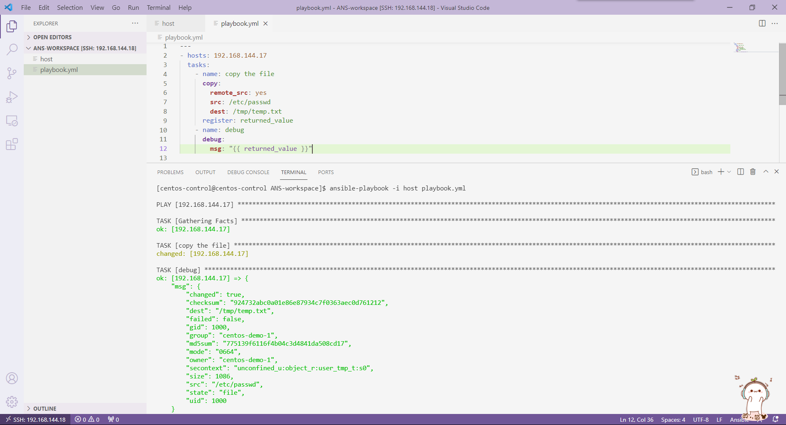

**注意：remote_src属性默认为no，指将控制主机文件拷贝到被管理主机，改为yes指远程主机自己拷贝自己；debug任务可删**


### 安装软件（以git为例）

**同命令：**`sudo yum install git`

1. 如图运行

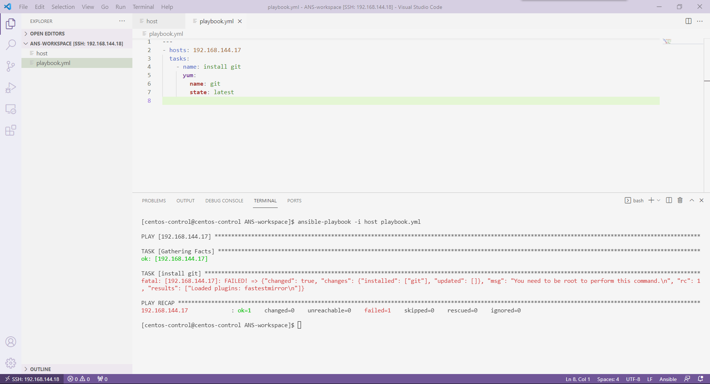

发现提示权限不足，这是因为我们是以普通用户方式登录，需要修改`host`文件，添加提权选项


2. 修改`host`文件，然后再次运行

```ini
# 格式：被控制主机ip ansible_user="被控制主机名" ansible_password="被控制主机密码"
# 注意属性之间必须有空格，但等号两侧不要加空格
192.168.144.17 ansible_user="centos-demo-1" ansible_password="123456" ansible_become=true ansible_become_user="root" ansible_become_password="123456"
```

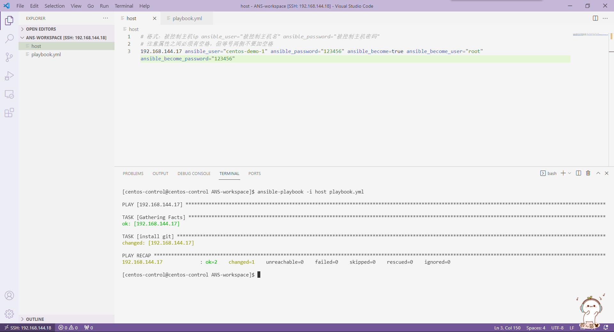


### 开启然后关闭防火墙端口

**同命令：**`firewall-cmd --permanent --add-port=8081/tcp`

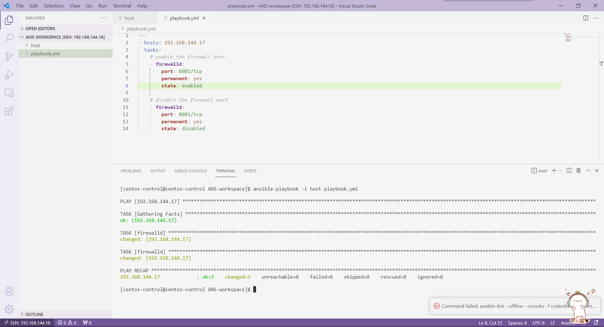


### 关闭然后开启服务

**同命令：**`sudo systemctl restart firewalld`

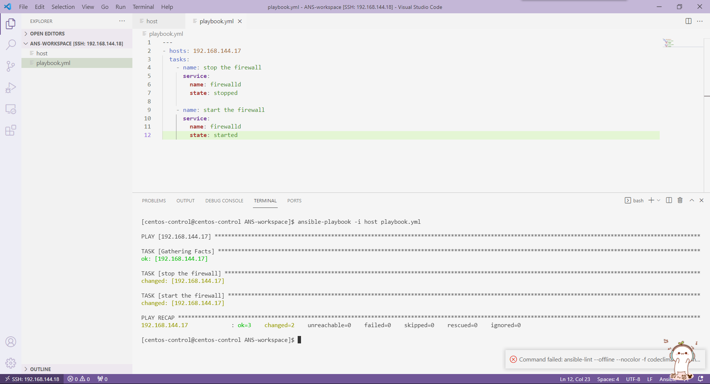


## 详细语法

### yaml格式

1. 大小写敏感
2. 缩进表示层级关系
3. 不能用tab缩进，一般两个空格代表一次缩进
4. #表示注释

```yml
# example.yml
--- # 三短横代表文件开始
# 短横代表数组
- apple:
  # 字典格式
  data0: xxx
  data1: xxx
  
- banana:
  # 普通写法
  xxx
  yyy
... # 三点代表文件结束，可以不加
```

**注意：冒号后必须加一个空格，短横后必须加一个空格**

可以使用python3检测yaml格式的合法性：

```python
# check.py
import yaml

with open("example.yml", 'r', encoding="utf-8") as f:
    try:
        print(yaml.safe_load(f))
    except Exception:
        print("PARSE ERROR")
```

```bash
python3 check.py
```


### inventory（库存）

#### ini格式

```ini
# host.ini
192.168.666 ...

[webserver]
# 分组管理
192.168.144.17 ansible_user="centos-demo-1" ansible_password="123456" ansible_become=true ansible_become_user="root" ansible_become_password="123456"
192.168.144.888 ...

[dbserver]
192.168.777 ...
```

#### yaml格式

```yml
# host.yml
---
all:
  hosts:
    192.168.666:
      ...
  children:
    webserver:
      hosts:
        192.168.144.17:
       	  ansible_user: centos-demo-1
       	  ansible_password: "123456"
       	  ansible_become: true
       	  ansible_become_user: root
       	  ansible_become_password: "123456"
        192.168.888:
          ...
    dbserver:
      hosts:
        192.168.777:
          ...
```

两种写法，一个意思。


### playbook（剧本）

```yml
# playbook.yml
---
- hosts: 192.168.144.17
  # 可以写成分组： `hosts: webserver`
  tasks:
  # 依次执行任务，每个任务都有一个changed属性，因此执行过的任务不会因为剧本多次运行而被重复执行
  - name: Leaving a mark
    file:
      state: touch
      dest: /tmp/1.txt

  - name: test the include method
    include: another_playbook.yml
```


## 配置文件

### 临时修改配置参数

```bash
export ANSIBLE_HOST_KEY_CHECKING=False
```

### 永久修改配置

```bash
sudo vi /etc/ansible/ansible.cfg
```

具体参数参考官网：<https://docs.ansible.com/ansible/2.9/reference_appendices/config.html#ansible-configuration-settings>


## 网络层面扩展

> 参考：https://docs.ansible.com/ansible/2.9/scenario_guides/network_guides.html

### Cisco ACI Guide

```yml
- name: Ensure tenant customer-xyz exists
  aci_tenant:
    host: my-apic-1
    username: admin
    password: my-password

    tenant: customer-xyz
    description: Customer XYZ
    state: present
```

