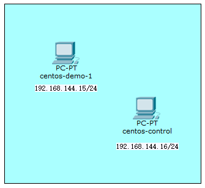

# Ansible复现

> 官方文档：https://docs.ansible.com/ansible/latest/

## 环境搭建

### 拓扑(HOST-ONLY网卡)

 

| name           | ip                | user/root pass |
| -------------- | ----------------- | -------------- |
| centos-demo-1  | 192.168.144.17/24 | 123456         |
| centos-control | 192.168.144.18/24 | 666            |


### 前提的前提

- Ansible版本 2.9 (or later)
- 控制节点：Python 2 (version 2.7) or Python 3 (version 3.5 or later)
- 被管理节点：Python 2 (version 2.6 or later) or Python 3 (version 3.5 or later)
- 选用该被管理云中的机器作为控制节点更合适

#### Centos 7.0

```bash
# 添加sudo
su root
chmod u+w /etc/sudoers
vi /etc/sudoers
# root ALL=(ALL)ALL
# `username` ALL=(ALL)ALL

# `ip a`查看网卡名
sudo vi /etc/sysconfig/network-scripts/ifcfg-enp0s8
# 配置信息修改
# BOOTPROTO=static/dhcp/none
# noboot=no => yes
sudo systemctl restart network

# 配置tsinghua镜像源（选）
# 先备份 /etc/yum.repos.d/ 内的文件（CentOS 7 及之前为 CentOS-Base.repo，CentOS 8 为CentOS-Linux-*.repo）
# 文件替换下面的'*'
sudo sed -e 's|^mirrorlist=|#mirrorlist=|g' \
         -e 's|^#baseurl=http://mirror.centos.org|baseurl=https://mirrors.tuna.tsinghua.edu.cn|g' \
         -i.bak \
         /etc/yum.repos.d/CentOS-*.repo
sudo yum makecache
```


#### Debian 11.1

> <https://www.debian.org/doc/manuals/debian-handbook/sect.network-config.zh-cn.html>

```bash
# 默认无sudo
su root

vi /etc/network/interfaces
# NAT网卡配置
# auto enp0s3
# iface enp0s3 inet dhcp
# HOST-ONLY网卡配置
# auto enp0s8
# iface enp0s8 inet dhcp

/etc/init.d/networking restart
```


#### Ubuntu 20.04.3

```bash
# 修改root密码
sudo passwd root
> ubuntu-control

# 安装配置ssh
sudo apt update && sudo apt install openssh-sftp-server ncurses-term ssh-import-id openssh-client
sudo vi /etc/ssh/ssh_config
# 去注释 PasswordAuthentication yes
sudo vi /etc/ssh/sshd_config
# 去注释 PermitRootLogin yes
sudo /etc/init.d/ssh restart
```


### 控制节点的先决条件

#### Centos 7.0

```bash
# 安装命令外壳
sudo yum update && sudo yum install epel-release
# sudo yum install python-argcomplete

# 安装python3.8和pip（可选）
sudo yum -y groupinstall "Development tools"
sudo yum -y install zlib-devel bzip2-devel openssl-devel ncurses-devel sqlite-devel readline-devel tk-devel gdbm-devel db4-devel libpcap-devel xz-devel
sudo yum install libffi-devel -y

sudo yum install wget
wget https://www.python.org/ftp/python/3.9.9/Python-3.9.9.tgz
# wget http://npm.taobao.org/mirrors/python/3.9.9/Python-3.9.9.tgz
tar zxvf Python-3.9.9.tgz

mkdir /usr/local/python3 #创建编译安装目录
cd Python-3.9.9
./configure --prefix=/usr/local/python3
make && sudo make install

# 查看当前python软连接
ll /usr/bin/ | grep python
rm -rf /usr/bin/python
#添加python3的软链接 
ln -s /usr/local/python3/bin/python3 /usr/bin/python
rm -rf /usr/bin/pip
#添加 pip3 的软链接
ln -s /usr/local/python3/bin/pip3 /usr/bin/pip

# 更改yum默认配置
# ↓ #! /usr/bin/python => #! /usr/bin/python2 ↓
vi /usr/bin/yum 
vi /usr/libexec/urlgrabber-ext-down 
vi /usr/bin/yum-config-manager
# 可能没有

# 安装连接模块
# 全局安装：`sudo ...`,除非完全了解修改系统上全局文件的含义，否则建议with `--user` 参数
python -m pip install --user paramiko
# pip install --user -i https://pypi.tuna.tsinghua.edu.cn/simple paramiko
sudo yum install sshpass
```

#### Ubuntu 20.04.3

```bash
$ sudo apt update && sudo apt install python3-pip -y
$ pip install paramiko --user 
```


### 控制节点安装Ansible

#### RHEL、CentOS或Fedora

在 CentOS 上：

```bash
$ sudo yum install ansible
```

在 Fedora 上：

```bash
$ sudo dnf install ansible
```

在 RHEL 上：

```bash
$ sudo yum install ansible
```


#### Ubuntu

Ubuntu 构建在 [PPA](https://launchpad.net/~ansible/+archive/ubuntu/ansible) 中可用（官方推荐）。

要配置 PPA 并安装 Ansible，运行以下命令：

```bash
$ sudo apt update
$ sudo apt install software-properties-common
$ sudo add-apt-repository --yes --update ppa:ansible/ansible
$ sudo apt install ansible
```

***在较旧的 Ubuntu 发行版中，“software-properties-common”被称为“python-software-properties”，旧版本中使用`apt-get`而不是`apt`。只有较新的发行版（即 18.04、18.10 等）才有`-u`or`--update`标志***


#### Debian

Debian 用户可以使用与 Ubuntu PPA 相同的源代码（使用下表）。

| Debian            |      | Ubuntu                 |
| ----------------- | ---- | ---------------------- |
| Debian 11（靶心） | ->   | Ubuntu 20.04（焦点）   |
| Debian 10（克星） | ->   | Ubuntu 18.04（仿生）   |
| Debian 9（扩展）  | ->   | Ubuntu 16.04 (Xenial)  |
| Debian 8 (杰西)   | ->   | Ubuntu 14.04（可信赖） |

***从 Ansible 4.0.0 开始，只会为 Ubuntu 18.04 (Bionic) 或更高版本生成新版本。***

将以下行添加到`/etc/apt/sources.list`or `/etc/apt/sources.list.d/ansible.list`：

```
deb http://ppa.launchpad.net/ansible/ansible/ubuntu MATCHING_UBUNTU_CODENAME_HERE main
```

Debian 11 示例（靶心）

```
deb http://ppa.launchpad.net/ansible/ansible/ubuntu focal main
```

然后运行这些命令：

```bash
$ sudo apt-key adv --keyserver keyserver.ubuntu.com --recv-keys 93C4A3FD7BB9C367
$ sudo apt update
$ sudo apt install ansible
```


#### pip（不建议）

```bash
$ python -m pip install --user ansible
$ python -m pip install --user paramiko
```


### 补充参数

```bash
# 或在cfg配置文件直接修改
export ANSIBLE_HOST_KEY_CHECKING=False
```


## 实验

### ssh-copy-id配置免密登录

1. 直接配置

```bash
# ansible -m ping 测试（ANS_VER == 2.9）
$ echo ${ip} ansible_user="${remotename}" ansible_password="${remotepass}" > hosts
$ ansible all -i hosts -m ping

$ pwd
> ~/.ssh
$ ssh-keygen -t rsa
$ ssh-copy-id -i $HOME/.ssh/id_rsa.pub "${remotename}"@${ip} -p 22

# 登录检查
$ ssh "${remotename}"@${ip}
```

2. 通过playbook自动配置

```yml
--- # hosts.yml
all:
  hosts:
    centos-demo-1:
      ansible_user: centos-demo-1
      ansible_host: 192.168.144.17
      ansible_port: 22
      ansible_password: "{{ password }}" # 需要另外配置var文件，定义password变量和值
      ansible_ssh_private_key_file: /home/centos-control/.ssh/id_rsa
      ansible_become: true
      ansible_become_user: root
      ansible_become_method: sudo
      ansible_become_password: "{{ password }}"
...
```

```yml
--- # ssh-copy-id.yml
- hosts: all # 对应`hosts`文件中定义的`主机组`名
  gather_facts: no # 如果不需要用到远程主机上的环境变量、运行时参数等，则可以跳过 gather_facts 阶段
  tasks:
  - name: deploy local rsa pub to remote host # 一句话描述任务
    authorized_key: # 任务使用到的 Ansible Module 名称，以下用缩进表示使用一系列参数传递给当前模块
      user: centos-demo-1 # 要配置root免密登录，就修改为root
      state: present
      key: "{{ lookup('file', lookup('env','HOME') + '/.ssh/id_rsa.pub') }}"
    become: true
    become_user: root
    become_method: sudo # 提权方法，例如Debian 9最小化安装方式等，默认无sudo，可改用su
...
```

```bash
$ ansible-playbook -i hosts.yml ssh-copy-id.yml
```


### 安装Apache

```yml
--- # hosts.yml
webserver:
  hosts:
    centos-demo-1:
      ansible_user: centos-demo-1
      ansible_host: "{{ demo_1_host }}"
      ansible_port: 22
      ansible_password: "{{ demo_1_password }}"
      ansible_ssh_private_key_file: /home/centos-control/.ssh/id_rsa
      ansible_become: true
      ansible_become_user: root
      ansible_become_method: sudo
      ansible_become_password: "{{ demo_1_password }}"
monitoring:
...
```

```yml
--- # apache-deploy.yml
## 批量部署Apache服务器

# 信息收集（技巧）
- hosts: monitoring

  tasks: []

# 部署Apache服务器
- hosts: centos-demo-1

  roles:
    - webservers
  
  tags:
    - web
...
```

```yml
# /roles/webservers/tasks/main.yml
--- # 安装apache服务器
- name: Install apache server
  yum:
    name: httpd
    state: latest

- name: ensure apache server is running
  service:
    name: httpd
    state: started
...
```


### 部署WordPress

> 源代码：https://github.com/ansible/ansible-examples/tree/master/wordpress-nginx_rhel7

#### 修改部分

```yml
--- # /site.yml
- name: Install WordPress, MariaDB, Nginx, and PHP-FPM
  # hosts: wordpress-server
  hosts: centos-demo-1
  remote_user: root
  # ...
```

```yml
--- # /hosts.yml
webserver:
  hosts:
    centos-demo-1:
      ansible_user: centos-demo-1
      ansible_host: "{{ demo_1_host }}"
      ansible_port: 22
      ansible_password: "{{ demo_1_password }}"
      ansible_ssh_private_key_file: /home/centos-control/.ssh/id_rsa
      ansible_become: true
      ansible_become_user: root
      ansible_become_method: sudo
      ansible_become_password: "{{ demo_1_password }}"
```

```yml
--- # /group_vars/webserver.yml
demo_1_host: "192.168.144.17"
demo_1_password: "123456"
```

```yml
--- # /roles/mariadb/tasks/main.yml
  # ...
  # 可能启动失败，进入运行 `sudo systemctl restart mariadb` ，再次运行playbook即可
- name: Start MariaDB Service
  service: name=mariadb state=started enabled=yes
  # ...
```

```yml
--- # /roles/php-fpm/tasks/main.yml
- name: Install php-fpm and deps
  	# ...
    # - php-simplepie 不兼容php5.4

- name: Disable default pool
  command: mv /etc/php-fpm.d/www.conf /etc/php-fpm.d/www.disabled creates=/etc/php-fpm.d/www.disabled
  notify: restart php-fpm

- name: Copy php-fpm configuration
  template: src=wordpress.conf dest=/etc/php-fpm.d/
  notify: restart php-fpm

```

```bash
$ ansible-playbook -i hosts.yml site.yml
...
$ curl -v 192.168.144.17
```

#### 撒花

 


